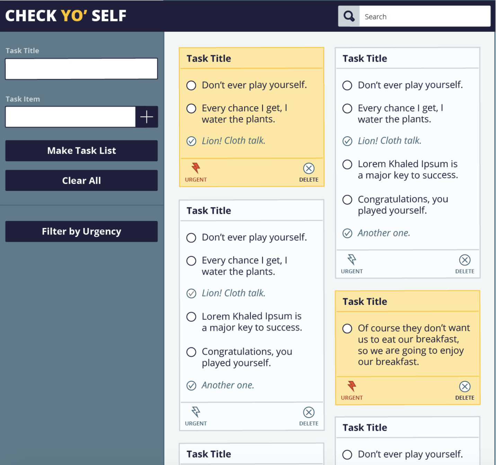
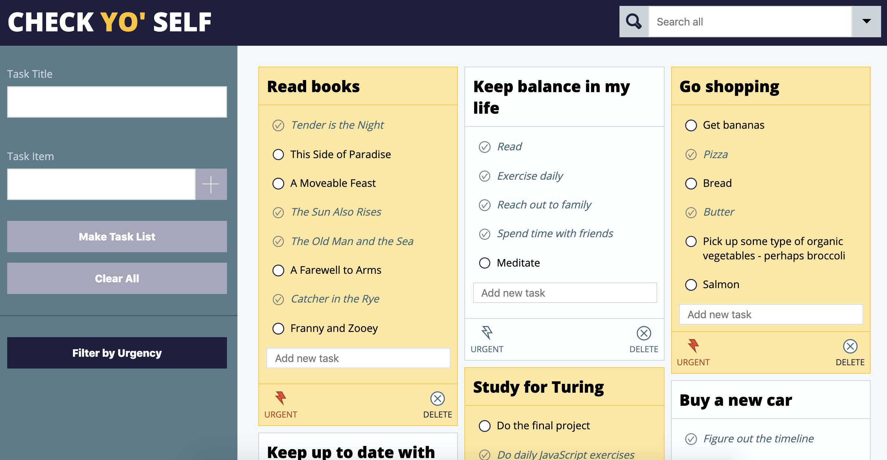
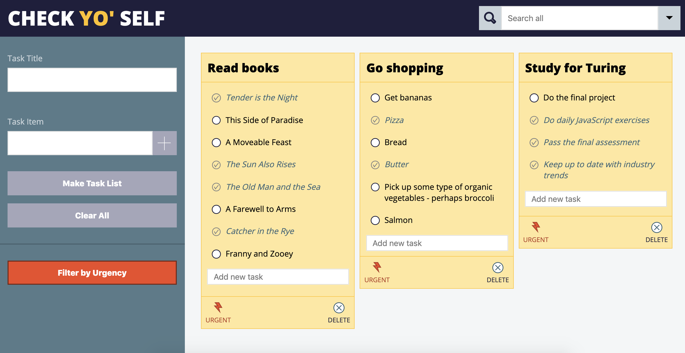
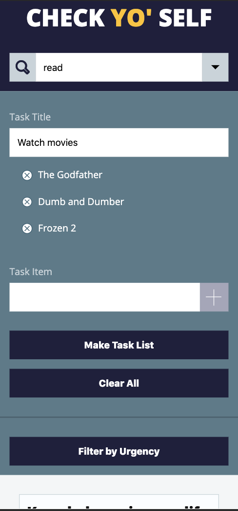
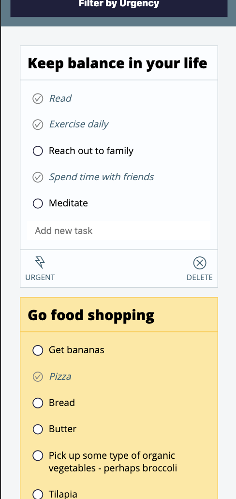

## README

# Overview of project and goals

The goal of this project was to recreate a task list app. The saved tasks persist after the page reloads. The user can check off tasks, mark task lists urgent, or delete a task list if all the tasks are completed.

I completed all user stories from Iterations 0-3, including the extensions from Iteration 3. The completed extensions include:

- Advanced search functionality (search by title, task or both).
- The ability to add tasks from within the card.
- The ability to edit tasks and titles within the card.

# Technologies used, challenges, and wins

Technologies used:
- HTML
- CSS
- JavaScript

Wins:
- I implemented template tags rather than injecting HTML via JavaScript.

# Screenshots of comp and my app
Comp:  

Screenshots:  

